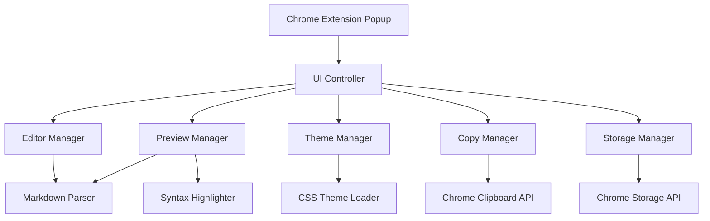

# Markdown Chrome Extension Design Document

## Overview

The Markdown Chrome Extension is a browser-based tool that provides a split-pane Markdown editor with real-time preview capabilities. The extension leverages Chrome's extension APIs for storage and clipboard operations, while using client-side JavaScript libraries for Markdown parsing and syntax highlighting.

## Architecture

### High-Level Architecture



### Component Architecture

The extension follows a modular architecture with clear separation of concerns:

- **UI Controller**: Orchestrates interactions between components
- **Editor Manager**: Handles text input, cursor management, and editing operations
- **Preview Manager**: Manages HTML rendering and scroll synchronization
- **Theme Manager**: Controls visual styling and theme switching
- **Copy Manager**: Handles clipboard operations and format conversion
- **Storage Manager**: Manages data persistence and user preferences

## Components and Interfaces

### 1. UI Controller (`UIController`)

**Responsibilities:**
- Initialize and coordinate all other components
- Handle user interactions and route them to appropriate managers
- Manage the overall application state

**Key Methods:**
```javascript
class UIController {
  initialize()
  handleEditorChange(content)
  handleThemeChange(theme)
  handleCopyAction(format)
}
```

### 2. Editor Manager (`EditorManager`)

**Responsibilities:**
- Manage the textarea element and its interactions
- Handle text selection, cursor position, and editing operations
- Provide formatting shortcuts and toolbar functionality

**Key Methods:**
```javascript
class EditorManager {
  insertText(text, wrapSelection = false)
  getContent()
  setContent(content)
  insertFormatting(type) // bold, italic, link, etc.
  getStats() // word count, character count
}
```

### 3. Preview Manager (`PreviewManager`)

**Responsibilities:**
- Convert Markdown to HTML using the parser
- Render HTML content in the preview pane
- Synchronize scrolling between editor and preview
- Apply syntax highlighting to code blocks

**Key Methods:**
```javascript
class PreviewManager {
  updatePreview(markdownContent)
  syncScroll(editorScrollTop)
  highlightCode()
}
```

### 4. Theme Manager (`ThemeManager`)

**Responsibilities:**
- Load and apply CSS themes
- Manage theme preferences
- Provide theme switching functionality

**Key Methods:**
```javascript
class ThemeManager {
  loadTheme(themeName)
  getAvailableThemes()
  setPageTheme(theme)
  setCodeTheme(theme)
}
```

### 5. Copy Manager (`CopyManager`)

**Responsibilities:**
- Handle clipboard write operations
- Format content for different platforms
- Provide user feedback for copy operations

**Key Methods:**
```javascript
class CopyManager {
  copyAsHTML(content)
  copyAsMarkdown(content)
  formatForPlatform(html, platform)
  showCopyNotification()
}
```

### 6. Storage Manager (`StorageManager`)

**Responsibilities:**
- Persist editor content and user preferences
- Handle auto-save functionality
- Manage storage quota and cleanup

**Key Methods:**
```javascript
class StorageManager {
  saveContent(content)
  loadContent()
  savePreferences(prefs)
  loadPreferences()
  autoSave(content)
}
```

## Data Models

### User Preferences Model
```javascript
const UserPreferences = {
  pageTheme: 'default', // 'default', 'dark', 'light'
  codeTheme: 'github',  // 'github', 'monokai', 'solarized'
  autoSave: true,
  autoSaveInterval: 2000, // milliseconds
  syncScroll: true,
  showStats: true
}
```

### Editor State Model
```javascript
const EditorState = {
  content: '',
  cursorPosition: 0,
  scrollPosition: 0,
  lastModified: Date.now(),
  wordCount: 0,
  charCount: 0
}
```

### Theme Configuration Model
```javascript
const ThemeConfig = {
  name: 'theme-name',
  displayName: 'Theme Display Name',
  cssFile: 'path/to/theme.css',
  type: 'page' | 'code',
  variables: {
    primaryColor: '#color',
    backgroundColor: '#color',
    textColor: '#color'
  }
}
```

## Error Handling

### Storage Errors
- Handle quota exceeded errors by implementing content cleanup
- Provide fallback to session storage if local storage fails
- Show user-friendly error messages for storage issues

### Clipboard Errors
- Gracefully handle clipboard permission denials
- Provide alternative copy methods (select text for manual copy)
- Show appropriate error notifications

### Parser Errors
- Handle malformed Markdown gracefully
- Provide error indicators for parsing issues
- Maintain partial rendering when possible

### Theme Loading Errors
- Fall back to default theme if custom theme fails to load
- Handle missing CSS files gracefully
- Provide error feedback for theme loading issues

## Testing Strategy

### Unit Testing
- Test individual component methods in isolation
- Mock external dependencies (Chrome APIs, DOM elements)
- Focus on core logic: parsing, formatting, storage operations
- Use Jest or similar testing framework

### Integration Testing
- Test component interactions and data flow
- Verify Chrome API integrations work correctly
- Test theme switching and persistence
- Validate clipboard operations across different content types

### User Acceptance Testing
- Test real-world usage scenarios
- Verify cross-platform compatibility (different operating systems)
- Test with various Markdown content types and sizes
- Validate performance with large documents

### Performance Testing
- Measure rendering performance with large Markdown documents
- Test memory usage and potential leaks
- Validate auto-save performance impact
- Test scroll synchronization smoothness

## Security Considerations

### Content Security Policy
- Implement strict CSP to prevent XSS attacks
- Sanitize HTML output from Markdown parser
- Validate all user inputs

### Data Privacy
- Store all data locally using Chrome storage APIs
- No external data transmission
- Clear data handling and privacy policies

### Permission Management
- Request minimal required permissions
- Use clipboardWrite permission only for copy operations
- Implement proper error handling for permission denials

## Performance Optimizations

### Rendering Optimization
- Implement debounced preview updates (500ms delay)
- Use virtual scrolling for large documents
- Lazy load syntax highlighting for code blocks

### Memory Management
- Implement content cleanup for old auto-saves
- Use efficient data structures for large text handling
- Clean up event listeners and observers properly

### Storage Optimization
- Compress stored content when possible
- Implement intelligent auto-save (only when content changes)
- Use efficient serialization for preferences